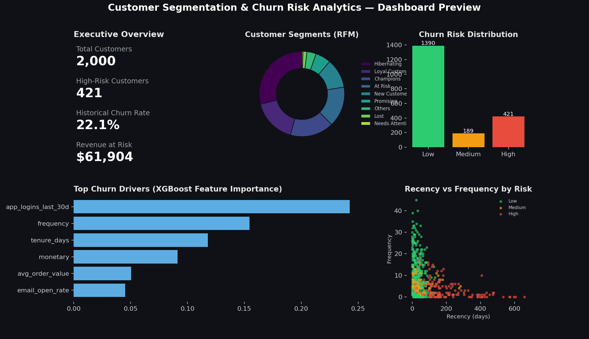
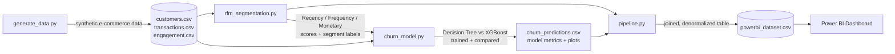

#  Customer Segmentation & Churn Risk Analytics Platform

**RFM segmentation + machine-learning churn prediction, delivered as a business-ready Power BI dashboard.**

Identify your most valuable customers, spot who's about to churn before they do, and get a concrete recommended action for each one.



---

##  What this project does

Most churn dashboards do one of two things: they segment customers (RFM) *or* they predict churn (ML) — rarely both, and rarely in a way a business team can actually act on. This project combines them into a single pipeline:

1. **RFM Segmentation** — scores every customer on **R**ecency, **F**requency, and **M**onetary value, and buckets them into 9 classic business segments (*Champions, Loyal Customers, At Risk, Hibernating, Lost*, etc.)
2. **Churn Prediction** — trains and compares a **Decision Tree** and an **XGBoost** classifier on behavioral + engagement features to output a calibrated churn *probability* for every customer (not just a segment label).
3. **Risk Scoring & Recommendations** — combines both into a `risk_tier` (Low / Medium / High) and a plain-English `recommended_action` per customer.
4. **Power BI Dashboard** — a ready-to-import dataset + full build guide (KPIs, DAX measures, chart layout) so the output is something a marketing/retention team would actually use.

---

##  Architecture



**Why this design?**
- **Synthetic data with real structure** — customers are generated from 5 behavioral archetypes (loyal, regular, occasional, one-and-done, new) so the resulting patterns are realistic enough for segmentation/ML to find genuine signal, unlike pure random data.
- **No label leakage** — churn is *defined* by recency (90+ days since last purchase), so recency itself is deliberately excluded from the model's input features. The model instead learns to anticipate churn from *leading* indicators — app logins, purchase frequency trend, support friction — which is what makes the prediction genuinely useful instead of just restating the label.
- **Two models, compared honestly** — a Decision Tree (interpretable baseline) and XGBoost (stronger, still explainable via feature importance) are trained side by side and the better one (by ROC-AUC) is automatically selected.

---

##  Project Structure

```
customer-churn-analytics/
├── data/
│   ├── generate_data.py        # synthetic dataset generator
│   ├── customers.csv           # generated: demographics + acquisition
│   ├── transactions.csv        # generated: 24-month purchase history
│   └── engagement.csv          # generated: app/support engagement signals
├── src/
│   ├── rfm_segmentation.py     # Recency/Frequency/Monetary scoring + segments
│   ├── churn_model.py          # feature engineering, Decision Tree + XGBoost
│   └── pipeline.py             # orchestrates the full run -> Power BI export
├── outputs/                     # generated: all model + dashboard artifacts
│   ├── rfm_segments.csv
│   ├── churn_predictions.csv
│   ├── powerbi_dataset.csv     # <- import THIS into Power BI
│   ├── segment_summary.csv
│   ├── model_comparison.json
│   ├── feature_importance.csv
│   ├── confusion_matrix.png
│   ├── roc_curve.png
│   └── churn_model.pkl
├── powerbi/
│   └── DASHBOARD_GUIDE.md      # step-by-step dashboard build guide + DAX
├── assets/
│   └── dashboard_preview.png
├── requirements.txt
├── .gitignore
├── LICENSE
└── README.md
```

---

##  Getting Started

### 1. Install dependencies
```bash
pip install -r requirements.txt
```

### 2. Run the full pipeline
```bash
python src/pipeline.py
```
This single command will:
- Generate a synthetic 2,000-customer dataset (if `data/` is empty)
- Compute RFM scores and assign segments
- Train the Decision Tree + XGBoost churn models, evaluate, and pick the winner
- Score every customer with a churn probability + risk tier
- Build `outputs/powerbi_dataset.csv`, ready to import into Power BI

### 3. Build the dashboard
Open **Power BI Desktop**, import `outputs/powerbi_dataset.csv`, and follow
[`powerbi/DASHBOARD_GUIDE.md`](powerbi/DASHBOARD_GUIDE.md) for the exact pages,
visuals, and DAX measures used to produce the preview above.

### Using your own data instead of the synthetic dataset
Replace `data/customers.csv` / `data/transactions.csv` / `data/engagement.csv`
with your real tables (same column names), then re-run `python src/pipeline.py`.

---

##  Results (on the included synthetic dataset)

| Model | Accuracy | Precision | Recall | F1 | ROC-AUC |
|---|---|---|---|---|---|
| Decision Tree | 0.81 | 0.55 | 0.74 | 0.63 | 0.836 |
| **XGBoost (selected)** | **0.83** | **0.60** | **0.69** | **0.64** | **0.874** |

**Top churn drivers** (XGBoost feature importance): recent app engagement, purchase
frequency, account tenure, and total monetary value — all signals a retention team
can act on *before* a customer goes quiet.

**Segment breakdown:**

| Segment | Customers | Avg. Spend | Avg. Churn Risk | High-Risk Count |
|---|---|---|---|---|
| Champions | 332 | $1,216 | 5% | 1 |
| Loyal Customers | 335 | $678 | 12% | 3 |
| At Risk | 307 | $625 | 33% | 78 |
| Hibernating | 578 | $54 | 54% | 299 |
| Lost | 30 | $231 | 74% | 24 |

> Exact numbers will vary slightly on re-runs due to the train/test split — see `outputs/model_comparison.json` for your run's actual figures.

---

##  Methodology Notes

**RFM scoring** uses quantile binning (1–5 per dimension) so segments are always
balanced regardless of the underlying data distribution, then maps R/F/M
combinations to standard segment names (Champions, At Risk, Hibernating, etc.)
using rule-based logic in `assign_segment()`.

**Churn label**: a customer is "churned" if they've had no purchase in the 90
days before the snapshot date *and* their account is older than 90 days (so
new sign-ups aren't unfairly flagged).

**Class imbalance** is handled via `class_weight="balanced"` (Decision Tree)
and `scale_pos_weight` (XGBoost), since churners are a minority class.

**Risk tiers**: Low (<33% probability), Medium (33–66%), High (>66%) — thresholds
are configurable in `churn_model.py`.

---

##  Tech Stack

- **Python** — pandas, NumPy for data engineering
- **scikit-learn** — Decision Tree classifier, train/test split, metrics
- **XGBoost** — gradient-boosted churn classifier
- **Matplotlib** — confusion matrix / ROC curve / preview visuals
- **Power BI** — final interactive dashboard layer
- **Faker** — realistic synthetic data generation

---

##  Possible Extensions
- Swap the rule-based RFM segments for K-Means clustering on R/F/M scores
- Add SHAP values for per-customer churn explanations
- Wire up a scheduled retrain + Power BI dataflow refresh
- Add a Streamlit app as a lightweight alternative front-end to Power BI

---

##  License
MIT — see [LICENSE](LICENSE).
